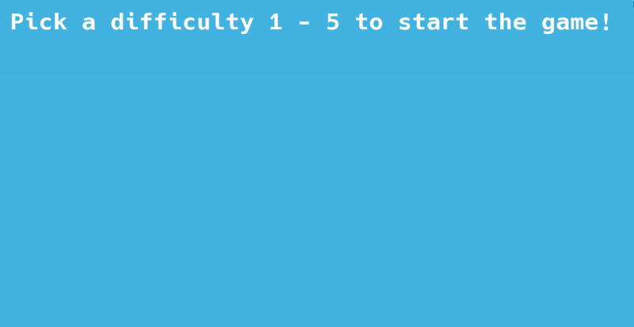

# Train Delivery & Infrastructure Simulation



A 3D arcade-style simulation game developed in C++ using the GFX Framework (described below). Navigate a train through a complex network of tracks, manage station cooldowns, and deliver resources to maximize your score within the time limit.

## Key Features
* **Dynamic Difficulty System:** Choose between 5 levels of difficulty at launch. Higher levels increase train speed and station cooldown times for a greater challenge.
* **Complex Track Navigation:** Real-time intersection handling using a dedicated navigation system (Forward, Soft, Hard, and Sharp turns).
* **Resource Management:** Collect Wood, Oil, and Stone from specialized stations to fulfill randomized orders at the Central Station.
* **Procedural World:** Features dynamic track generation including tunnels (mountains), bridges (water), and sleepers.
* **Dual Camera System:** Toggle between a rail-locked Third-Person view and a Free-Look camera for exploration.
* **Minimap:** Real-time top-down tracking of the train's position and the surrounding rail infrastructure.

## Controls
### Start Menu
* `1` - `5`: Select difficulty level and start the game.

### Train Navigation
* `W`: Resolve intersection Forward
* `Q / E`: Soft Turn (Left / Right)
* `A / D`: Hard 90-degree Turn (Left / Right)
* `Z / C`: Sharp Turn (Left / Right)

### Camera & Tools
* `J`: Toggle between First/Third-Person and Free Camera mode.
* `Right Click + Mouse`: Rotate camera view.
* `W, A, S, D, Q, E`: Movement (only in Free Camera mode).
* `P`: Reset to perspective projection.

## Technical Details
* **Language:** C++
* **Graphics API:** OpenGL 3.3+
* **Mathematics:** GLM (OpenGL Mathematics)
* **Window Management:** GLFW / FreeGLUT
* **Text Rendering:** Custom FreeType-based text renderer for UI elements.

## Installation & Build
1. Clone the repository.
2. Ensure you have the necessary OpenGL dependencies (GLFW, GLEW/glad).
3. Open the `.sln` file in Visual Studio.
4. Build in **Debug** or **Release** (x64 recommended).
5. Run the executable. (Ensure the `assets/` or `resources/` folder is in the working directory for font loading).


# GFX Framework

## :sparkles: Introduction

This project is a tiny graphics framework used by the Computer Graphics Department of the Polytechnic University of Bucharest.
It is currently used as teaching and study material for a number of courses of increasing complexity, including, but not limited to:

-   **`EGC`** Elements of Computer Graphics, BSc year 3 &mdash; [course materials (RO)](https://ocw.cs.pub.ro/courses/egc)
-   **`PGAPI`** Advanced Graphics Programming and Image Processing, BSc year 4 &mdash; [course materials (RO)](https://ocw.cs.pub.ro/courses/pgapi)

The functionality is split into several modules of increasing difficulty (`m1`, `m2`, etc.).

You can read more about it [in the docs](docs/home.md).

It has missing and closed-source functionality that you will need to implement.

The code is cross-platform, and supports the following architectures:

-   Windows: `i686`, `x86_64`, `arm64`
-   Linux: `i686`, `x86_64`, `arm64`
-   macOS: `x86_64`, `arm64`


## :white_check_mark: Prerequisites

This section describes ***what you need to do and install*** before actually building the code.


### Install a compiler

The compiler requirements are listed below. We strongly recommend to always use the latest compiler versions.

-   Minimum:
    -   Windows: Visual Studio 2015 Update 3 with `Programming Languages -> Visual C++` checked when installing
    -   Linux: `g++` version 5
    -   macOS: `clang++` version 4

-   Recommended:
    -   Windows: Visual Studio 2022 with `Workloads -> Desktop development with C++` checked when installing
        -    When installing Visual Studio 2019 or later, double-check that you selected "Desktop development with C++". This should download and install approximately 8 GB of stuff from the Microsoft servers. If you installed Visual Studio and it only took several minutes, you probably missed this step
    -   Linux: `g++` latest
    -   macOS: `clang++` latest, by doing one of the following:
        -   for LLVM/Clang: install [`brew`](https://brew.sh/) then run `brew install llvm`
        -   for Apple Clang: install XCode


### Install an editor

We recommend the following editors:

-    Windows: Visual Studio (***not*** the same thing as Visual Studio Code)
-    Linux: Visual Studio Code
-    macOS: Visual Studio Code (***do not*** use Visual Studio for Mac, as it's discontinued)


### Install or update your graphics drivers

Use the following steps as a guideline. Detailed instructions differ across manufacturers and operating systems, and are ***not*** covered here.

-   Update the drivers for your integrated graphics processor (for example, Intel Graphics XXXX)
-   Update the drivers for your dedicated graphics card, if your computer has one:
    -   for Nvidia cards: https://www.nvidia.com/Download/index.aspx
    -   for AMD cards: https://www.amd.com/en/support

Not updating your drivers may result in the project not working, or displaying a white screen.


### Check your graphics capabilities

Graphics capabilities are decided by the combination of your computer's hardware, drivers, and operating system.

This project requires OpenGL version ***3.3 core profile, or newer*** for the simpler parts, and version ***4.3 core profile, or newer***  for the more advanced parts. If you have a computer manufactured within the last few years, you should be safe. ***If you're not sure,*** follow the steps in [this guide](docs/user/checking_capabilities.md) to find out.


### Install the third-party libraries

There are some open-source libraries that this project uses. To install them:

-   Windows: you don't need to do anything - all necessary libraries are already provided with the code

-   Linux: depending on your distribution, run one of the following scripts as superuser:
    -   Debian (Ubuntu): `./tools/deps-ubuntu.sh`
    -   Red Hat (Fedora): `./tools/deps-fedora.sh`
    -   Arch (x86_64): `./tools/deps-arch.sh`

-   macOS: install [`brew`](https://brew.sh/) then run `./tools/deps-macos.sh`


### Install the build tools

This project uses [CMake][ref-cmake]. It a nutshell, CMake does not compile source code, instead it creates files that you then use to compile your code (for example, it creates a Makefile on Linux and macOS, a Visual Studio project on Windows, and so on).

This project requires CMake ***3.16 or newer,*** however, as with the compilers, we strongly recommend that you use the latest version. To install it, follow these steps:

-   Windows:
    1.  go to the [CMake downloads page][ref-cmake-dl]
    2.  download the latest version of the file called `cmake-<VERSION>-windows-x86_64.msi`
    3.  install it

-   Linux:
    1.  use your package manager to install `cmake`
    2.  check the version using `cmake --version`
    3.  depending on the version:
        -   if it's the minimum required (see above), you're all set
        -   otherwise, run `./tools/install-cmake.sh && . ~/.profile` in a terminal

-   macOS:
    1.  run `brew install cmake`

After installation, run `cmake --version` to check that it's in your `PATH` environment variable. This should happen automatically, but if it didn't, just add it manually. Instructions on how to add an executable to your `PATH` differ across operating systems and are ***not*** covered here.


## :gear: Building

Open a terminal and go into the root folder of the project, which contains the top-level `CMakeLists.txt` file.
Do not run CMake directly from the top-level folder (meaning, do not do this: `cmake .`). Instead, make a separate directory, as follows:

1.  `mkdir build`
2.  `cd build`
3.  Generate the project:
    -   for module 1 labs (default): `cmake ..`
    -   for module 2 labs: `cmake .. -DWITH_LAB_M1=0 -DWITH_LAB_M2=1`
    -   for extra labs: `cmake .. -DWITH_LAB_M1=0 -DWITH_LAB_EXTRA=1`
    -   for none (`SimpleScene` only): `cmake .. -DWITH_LAB_M1=0`
4.  Build the project:
    -   Windows, one of the following:
        -   `cmake --build .`
        -   or just double-click the `.sln` file to open it in Visual Studio, then press `Ctrl+Shift+B` to build it
    -   Linux and macOS, one of the following:
        -   `cmake --build .`
        -   or just `make`

That's it! :tada:

***Note:*** When running the CMake generation step on Windows (meaning, `cmake ..`), you may receive errors that include the phrase `Permission denied`. If you currently have the framework on the `C:` drive, for example on the Desktop, you might not have write permissions. Experimentally, we've found that this happens on single-drive devices (meaning, for example, computers with no disk partition other than `C:`). As an alternative, move the framework on the top-level (directly in `C:`) or create another drive partition (for example `D:`) and move it there.


### Rebuilding

It's very simple to rebuild:

-   Every time you modify source code and want to recompile, you only need to follow ***the last step*** (for example, just `make` again)
-   Every time you add/remove/rename a source code file on disk, you need to follow ***the last two steps*** (for example, just `cmake .. && make` again)
-   If something goes wrong when generating the project, just delete the contents of the `build` folder, or the folder itself, then follow all the steps again


## :rocket: Running

You can run the project from an IDE, as well as standalone, from anywhere on disk. For example:

-   Windows, one of the following:
    -   `.\bin\Debug\GFXFramework`
    -   or just open the `.sln` file in Visual Studio, then press `F5` to run it

-   Linux and macOS:
    -   `./bin/Debug/GFXFramework`

To run a certain lab:

-   Go into `main.cpp`
-   Find this line:
    ```cpp
    World *world = new gfxc::SimpleScene();
    ```
-   Replace it with whatever you want to run, for example:
    ```cpp
    World *world = new m1::Lab1();
    World *world = new m2::Lab1();
    World *world = new extra::TessellationShader();
    // etc.
    ```


## :book: Documentation

All user and developer documentation can be found in the `docs` directory.


## :wrench: Contributing

See the [CONTRIBUTING.md](CONTRIBUTING.md) file for more info.
A future roadmap is ***TBD***.


## :page_facing_up: License

This project is available under the [MIT][ref-mit] license; see [LICENSE.md](LICENSE.md) for the full license text.
This project also includes external libraries that are available under a variety of licenses; see [LEGAL.txt](LEGAL.txt)
for the full license texts and legal notices.


[ref-cmake]:            https://github.com/Kitware/CMake/
[ref-cmake-dl]:         https://github.com/Kitware/CMake/releases/
[ref-cmake-build]:      https://github.com/Kitware/CMake#building-cmake-from-scratch
[ref-mit]:              https://opensource.org/licenses/MIT
